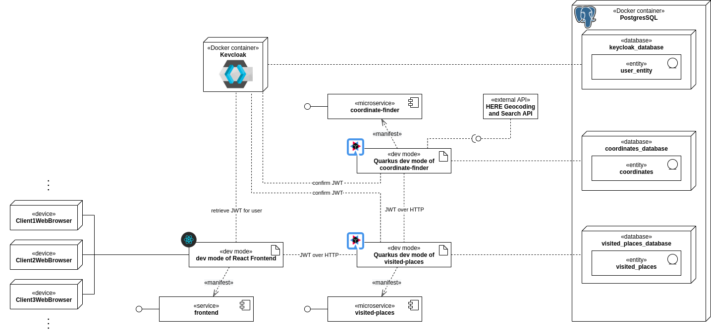

# Project of Network Programming

This repository includes Sanskar Gupta's (frontend) and Felix Seifert's (backend) project work of the course Network 
Programming at KTH Royal Institute of Technology. The project is a small microservices-based application (MSA) which is 
based on the [Quarkus framework](https://quarkus.io/).

The idea is that a user can log in and store which places he/she visited from when to when. After a successful login 
via the Keycloak application, his/her inputs are sent to the microservice [`visited-places`](visited-places) which 
stores it in a PostgreSQL database. The user can then request to see his/her places on a map. The places would be 
enriched with the actual coordinates by the microservice [`coordinate-finder`](coordinate-finder). The 
[`frontend`](frontend) then displays these places with markers whose size depend on the duration the user stayed over 
there.

## Architecture

The architecture for a local desktop setup is shown in the following image. How to start the full application, have 
a look under the section [Full Test](#full-test).



Users call the `frontend` where they have to identify. The Keycloak application then authenticates them and returns 
a token. With this token, the `frontend` taks to `visited-places` to operate CRUD operations on the places this user 
visited. If places have to be returned, `coordinate-finder` provides the coordinates for these places. 
`coordinate-finder` checks whether they are in its own database. If the coordinates are not stored in the database, 
the [HERE Geocoding and Search API is approached](https://developer.here.com/documentation/geocoding-search-api/dev_guide/index.html).

## Infrastructure

The infrastructure consists out of a PostgreSQL database container and a Keycloak identity and access management
application. To run both container, you would have to run the `docker-compose.yml` file.

```bash
docker-compose up -d
```

### PostgreSQL

According to the database per service pattern, each service receives its own database within the PostgreSQL container. 
The credentials of the databases for the different microservices can be seen in the 
[`init-databases.sql`](infrastructure/postgres/init-databases.sql) file. To access the different databases, use the 
following Docker command and adapt it to your needs.

```
sudo docker exec -it postgres psql -d <database> -U <user> -W
```

### Keycloak

The Keycloak application is automatically initialised with the settings from the file 
[`realm-network-programming-project.json`](infrastructure/keycloak/realm-network-programming-project.json). Currently, 
all functions of the backend are available for the role `USER`. Upon start-up, the user `alex` with the password `alex` 
and the role `USER` is created automatically.

The admin console of Keycloak is available under [http://localhost:8180/auth/admin/](http://localhost:8180/auth/admin/).

## Microservices

The microservices of the backend of the MSA can currently be started only separately. For starting a service, go to its 
directory and start it either in the Quarkus development mode, like a normal Java application or compile it to a native 
executable. For more information on how to run Quarkus applications, please consult the 
[Quarkus page about Maven tooling](https://quarkus.io/guides/maven-tooling.html).

To start the React frontend, have a look at the [description within the frontend folder](frontend).

## Test

### Full Test

To spin up the full application and use it in the web-browser, run the following steps:

1. Start the infrastructure with Docker Compose.
    ```
    cd infrastructure && \
    sudo docker-compose up -d && \
    cd ..
    ```

2. Insert an [API key for the HERE Geocoding and Search API](https://developer.here.com/sign-up) in the 
   [`applications.properties`](coordinate-finder/src/main/resources/application.properties) file of the microservice 
   `coordinate-finder`.
   
3. Start the microservice `coordinate-finder` in the Quarkus DEV mode.
    ```
    cd coordinate-finder && \
    ./mvnw compile quarkus:dev
    ```

4. Start the microservice `visited-places` in the Quarkus DEV mode.
    ```
    cd visited-places && \
    ./mvnw compile quarkus:dev &&
    ```

5. Run `npm install` int the frontend folder, create a `.env` file with the necessary content and start the app in 
   DEV mode.
   ```
   cd frontend && \
   npm install && \
   echo "REACT_APP_MAPBOX_ACCESS_TOKEN='pk.eyJ1Ijoic2Fuc2thcjk1IiwiYSI6ImNraml5dWo5ZDJtZDkydnNjdWtscXZxNm0ifQ.cb8o0SXu2SJY-aqquDCwqw'
   REACT_APP_AUTH_SERVER_OIDC_TOKEN_URL='http://localhost:8180/auth/realms/network-programming-project/protocol/openid-connect/token'
   REACT_APP_VISITED_PLACE_URL='http://localhost:8081/api/v1/places'" > .env && \
   npm start
   ```

### Terminal Test

To test the identity framework with its authentication and authorisation, start the infrastructure and start the 
microservices [`visited-places`](visited-places) and [`coordinate-finder`](coordinate-finder). Then, query Keycloak to 
receive a valid access token (and store it for simplicity). 

```bash
export access_token=$( \
    curl -X POST http://localhost:8180/auth/realms/network-programming-project/protocol/openid-connect/token \
    --user frontend: \
    -H 'content-type: application/x-www-form-urlencoded' \
    -d 'username=alex&password=alex&grant_type=password' | jq --raw-output '.access_token' \
 )
```

You should use the credentials of the client `frontend` because the clients for the backend microservices are not 
allowed to request new tokens and can only verify them. Besides the client credentials, which represent a certain 
service, you also need the user credentials which identify the actual end-user of the system.

Use this token then as a `Bearer` token to query the `visited-places` service which uses the token to check the user's 
authorisation and retrieve the user's identity from it.

```bash
curl -v -X GET \
  http://localhost:8081/api/v1/places \
  -H "Authorization: Bearer "$access_token
```

As stored in the database, this endpoint returns the places the user visited and the dates from when to when. 
In addition, you can find the longitude and latitude of this place. These details are retrieved from the microservice 
`coordinate-finder`. This microservice gets the coordinates from its own database. If they are not stored in there, it 
queries the [HERE Geocoding and Search API](https://developer.here.com/documentation/geocoding-search-api/dev_guide/topics/endpoint-geocode-brief.html). 
The current solution has some coordinate inaccuracies.

To successfully query the API of Here, you would need to [register for a free API key](https://developer.here.com/sign-up) 
and enter it in the [`applications.properties`](coordinate-finder/src/main/resources/application.properties) file of the
microservice `coordinate-finder`.

## Used Technology

The frontend is built in **JavaScript** with **React**. 

The backend microservices are built in **Java** with **Quarkus**. The REST endpoints are realised with **JAX-RS** and 
the databases are accessed with **Hibernate ORM with Panache**. The RDBMS **PostgreSQL** and the identity and access 
management solution **Keycloak** for Open ID Connect are used as **Docker** containers and managed with 
**Docker Compose**.
